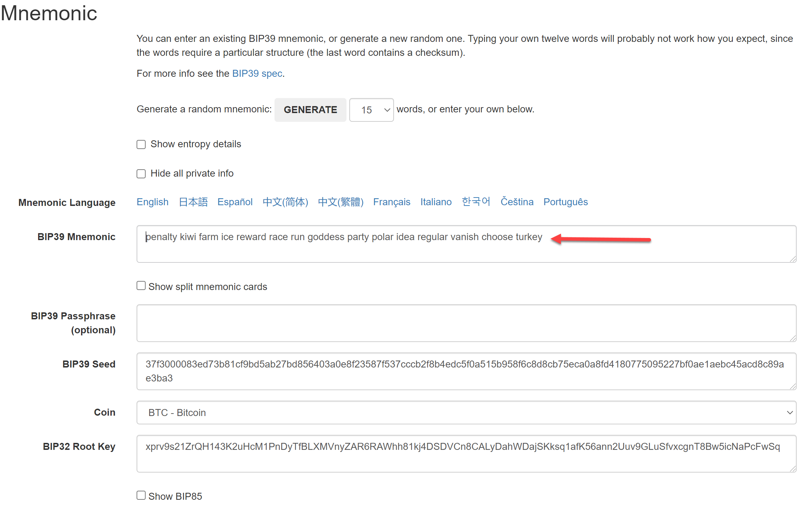
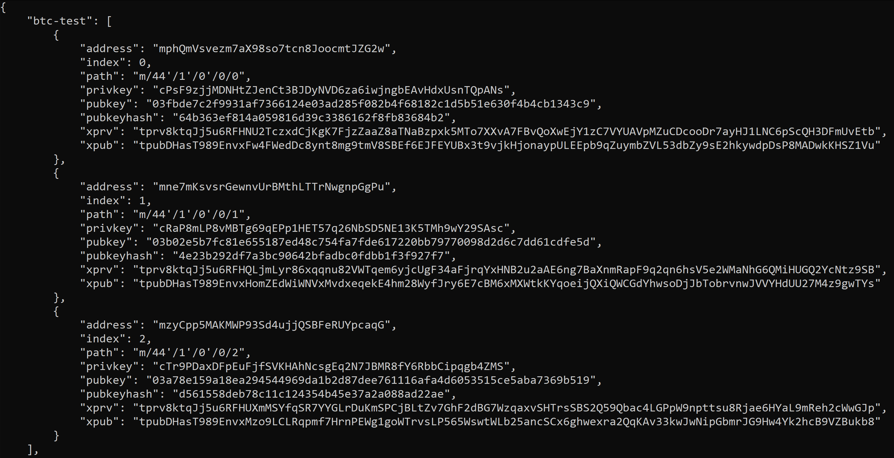
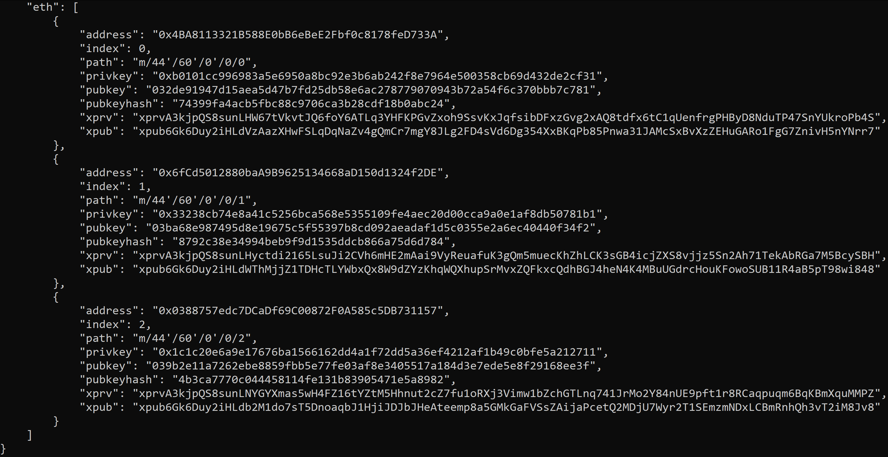
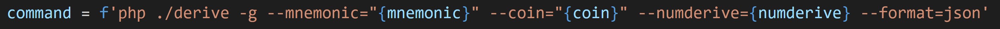
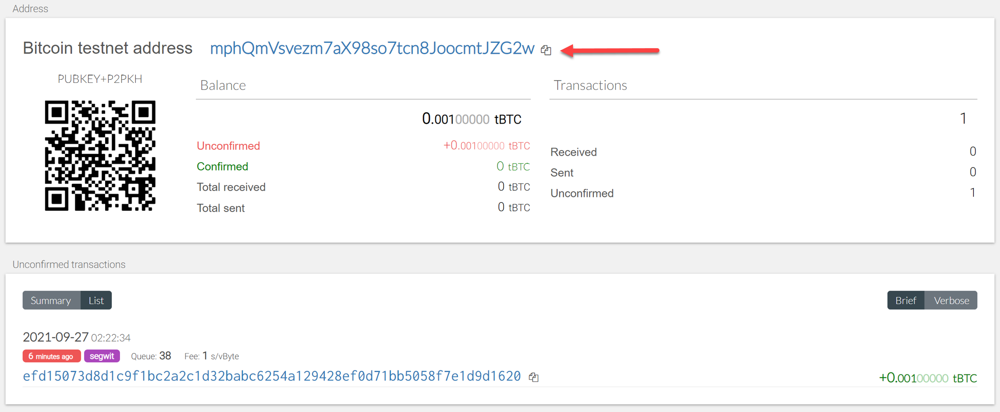
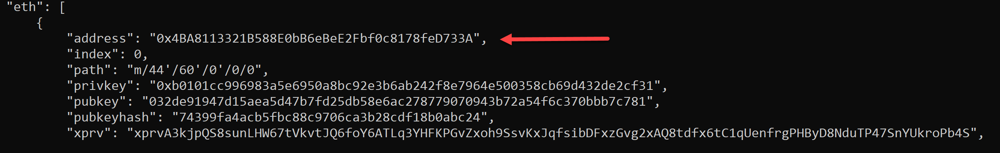
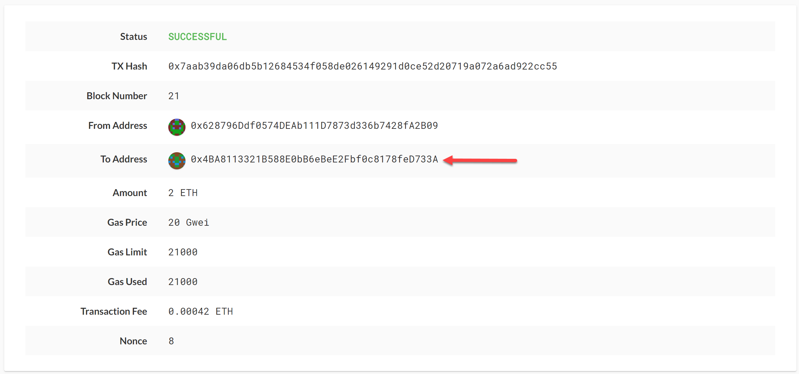
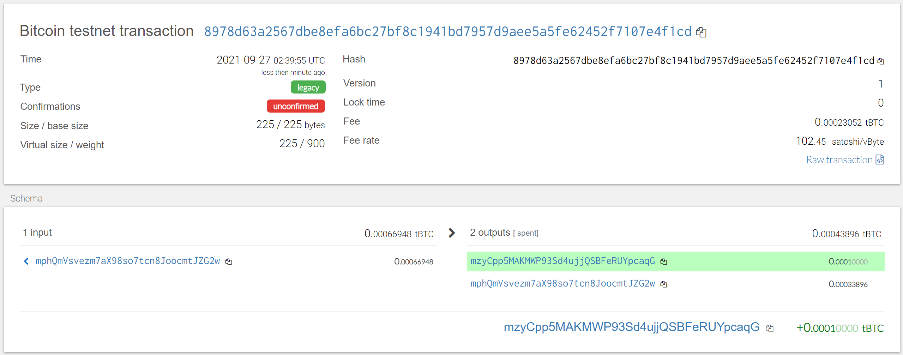
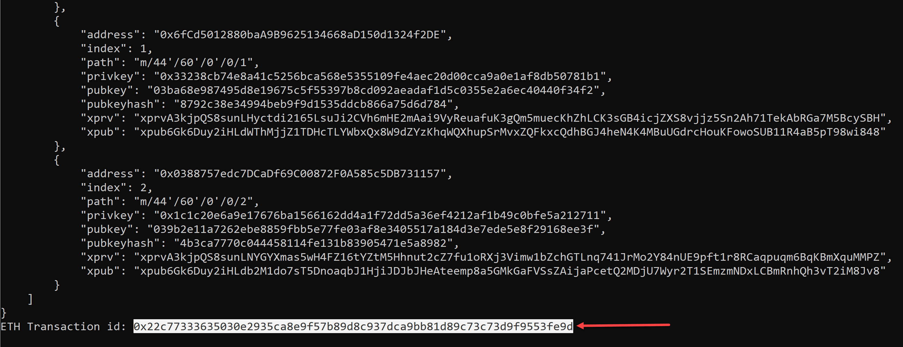
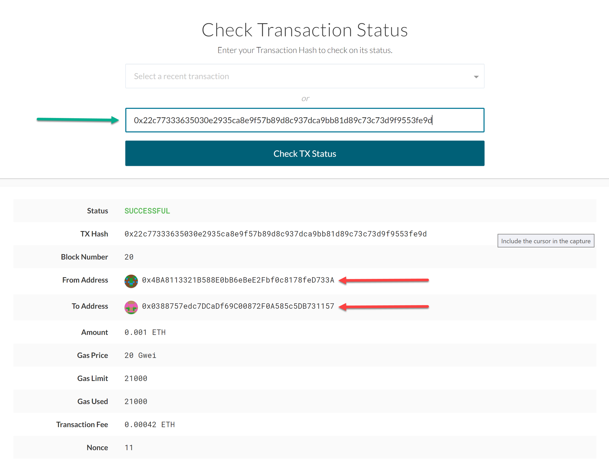

# Multi-Blockchain Wallet in Python


## Instructions

### 1. HD-Wallet Setup

To create wallets we need to have HD-Wallet installed on the system. Here are the quick instractions to setup:

* Install PHP interpretter first
* Clone `hd-wallet-derive` locally
```
  $ git clone https://github.com/dan-da/hd-wallet-derive
  $ cd hd-wallet-derive
  $ curl https://getcomposer.org/installer -o installer.php
  $ php installer.php
  $ php composer.phar install  
```

* Create a Symlink for `hd-wallet-derive.php` for efficent usages.
  - Within bash, run the command export MSYS=winsymlinks:nativestrict.
  - Run the following command: ln -s hd-wallet-derive/hd-wallet-derive.php derive.
  - Test that you can run the ./derive script properly, by running the following command.
    - ```
      ./derive --key=xprv9zbB6Xchu2zRkf6jSEnH9vuy7tpBuq2njDRr9efSGBXSYr1QtN8QHRur28QLQvKRqFThCxopdS1UD61a5q6jGyuJPGLDV9XfYHQto72DAE8 --cols=path,address --coin=ZEC --numderive=3 -g
      ```

### 2. HD-Wallet Usage
First of all, you need to generate a mnemonic phrase using [this link](https://iancoleman.io/bip39/). It would look like this:

|  | 
|:--:| 
| *Mnemonic Generation* |

Then, set this mnemonic as an environment variable by storing it a an .env file and importing it into the project file. (line 18 in the code)

HD-wallet makes BIP-44 Key-pairs and addresses for any coin and token. Here are some wallets made by the code (lines 21-30 -the function- and 91-92 -generating wallet for BTCTEST and ETH-)

|  | 
|:--:| 
| *BTCTEST Wallets* |


|  | 
|:--:| 
| *ETH Wallets* |

Here is how you call the HD-wallet inside the code with the parameters: (line 22 in the code)

|  | 
|:--:| 
| *HD-wallet Call* |

The following flags are passed into the shell command as variables:
  - Mnemonic (`--mnemonic`) is set from an environment variable
  - Coin (`--coin`)
  - Numderive (`--numderive`) is to set number of child keys generated
  - Format (`--format=json`) is to parse the output into a JSON object using `json.loads(output)`

### 3. Funding the Wallet
To fund the wallet you can use [this link](https://testnet-faucet.mempool.co/) for BTCTEST and Ganache or simply Geth via MyCrypto to fund your ETH wallet.

|  | 
|:--:| 
| *Funding BTCTEST Wallet* |

|  | 
|:--:| 
| *Funding ETH Wallet* |

|  | 
|:--:| 
| *Funding ETH Wallet* |


### 4. Transactions
To make transactions you first need to map privete keys into accounts (code lines 34-43), then you need to create a transaction using the created account, the recepient and the amount (lines 47-68 in the code), and finally you can send the transaction using the created account, the recepient and the amount (lines 72-86). 

### 4.1 BTCTEST Transaction
Giving the wallet#0 as the sender and wallet#2 as the receiver, here is the screeshot of the successful transaction:

|  | 
|:--:| 
| *BTCTEST Transaction Result* |

### 4.2 ETH Transaction
Giving the wallet#0 as the sender and wallet#2 as the receiver, here is the screeshot of the successful transaction:

|  | 
|:--:| 
| *ETH Transaction Result in Terminal* |

|  | 
|:--:| 
| *ETH Transaction Result in MyCrypto* |

